## Job4j_cars

## Проект "Сайт по продаже авто"

###  Описание проекта

Проект представляет собой упрощенный сервис по продаже авто, в котором можно выложить обявление, которое включает 
в себя описание, марку автомобиля, тип двигателя, тип кузова, стоимость и статус самого объявления (актуально/продан).


### Использованные технологии
* Spring Framework 2.7.3
* PostgresSQL 42.5.1
* Liquibase 4.15.0
* H2 database
* Hibernate 5.6.11.Final
* Collections Framework
* HTML, CSS
* Bootstrap
* Lombok

### Требование к окружению
* Java 17
* PostgresSQL 15
* Apache maven 3.8

### Запуск проекта
1. Установить JDK 17
2. Установить Maven
3. Установить сервер БД PostgresSQL, при установке задать имя пользователя - postgres, пароль postgres, порт - 5432
4. Открыть postgresSQL при помощи команды в терминале: 
``sudo -u postgres psql``
5. Создать БД cars и подключиться к ней<br><br>
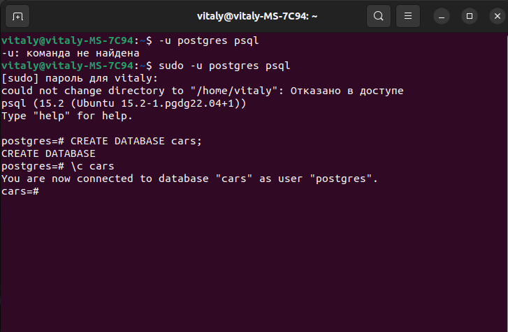<br><br>
6. С помощью команд создаем таблицы:
```postgres-sql 
CREATE TABLE auto_user (
id serial primary key,
login varchar unique not null,
password varchar not null
);

CREATE TABLE car_body (
id serial primary key,
name varchar unique not null
);

CREATE TABLE engine(
id serial primary key,
name varchar unique not null
);

CREATE TABLE marks (
id serial primary key,
name varchar unique not null
);

CREATE TABLE driver(
id serial primary key,
name varchar,
user_id int not null unique REFERENCES auto_user(id)
);

CREATE TABLE car(
id serial primary key,
name varchar not null,
engine_id int not null REFERENCES engine(id),
mark_id int REFERENCES marks(id),
car_body_id int REFERENCES car_body(id)
);
CREATE TABLE history_owner(
id serial primary key,
driver_id int not null REFERENCES driver(id),
car_id int not null REFERENCES car(id)
);

CREATE TABLE auto_post (
id serial primary key,
description varchar not null,
sold boolean,
car_body_id int REFERENCES car_body(id),
auto_user_id int REFERENCES auto_user(id),
car_id int REFERENCES car(id),
price int,
mark_id int REFERENCES marks(id),
created TIMESTAMP
);

CREATE TABLE files (
id serial primary key,
name varchar not null,
path varchar unique not null,
auto_post_id int REFERENCES auto_post(id)
);

CREATE TABLE participates (
user_id int REFERENCES auto_user(id),
post_id int REFERENCES auto_post(id)
); 
  ```
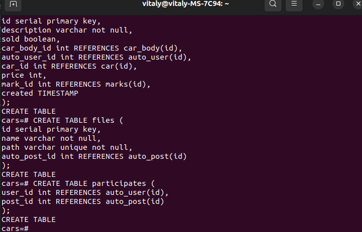
7. Заполним значения для таблиц обозначающих: кузов, марку, двигатель:
```postgres-sql
    INSERT INTO car_body(name) VALUES('седан');
    INSERT INTO car_body(name) VALUES('хэтчбек');
    
    INSERT INTO marks(name) VALUES('Toyota');
    INSERT INTO marks(name) VALUES('Honda');
    
    INSERT INTO engine(name) VALUES('Vtec');
    INSERT INTO engine(name) VALUES('4A-GE');
```
8. При помощи терминала перейдите в папку с исходным кодом и выполните команду:
``mvn spring-boot:run``
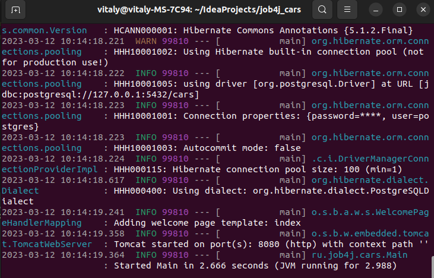
9. Откройте браузер с URL: http://localhost:8080/

### Взаимодействие с приложением 
* С самого начала объявлений на сайте отсутсвуют, для того, чтобы создать объявление необходимо зарегистрироваться:
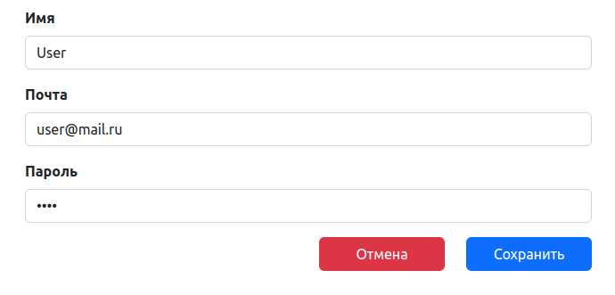
* Далее проходим под зарегестрированным логином 
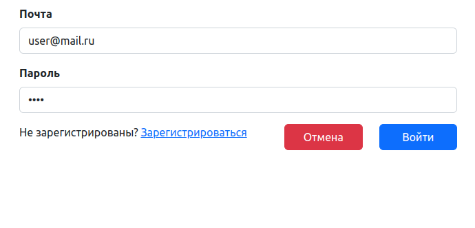
* Т.к. объявлений на сайте еще нет при переходе по ссылке все объявления, приложение отправляет пользователя 
на страницу создания нового объявления:
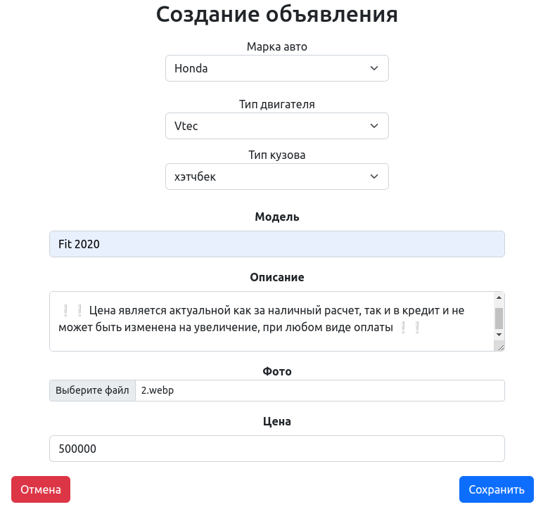
* После создания объявления, приложение открывает страницу со всеми объявлениями:
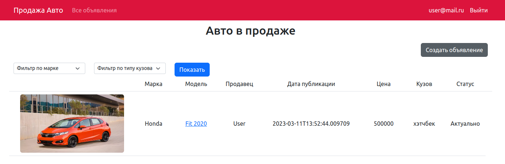
* На этой странице имеется возможность фильтрации по марке автомобиля и тпу кузова
* Создавать новые объявления могут только зарегистрированные пользователи:
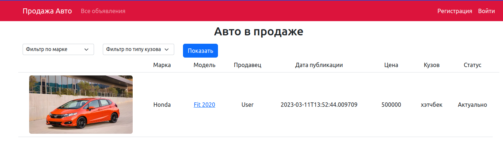
* Нажав на ссылку в объявлении (марка машины) приложение открывает страницу с подробным описанием:
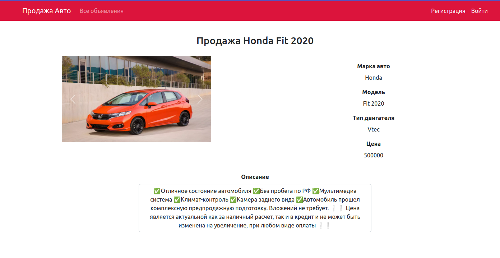
* Только автор объявления может добавить фото или изменить статус объявления:
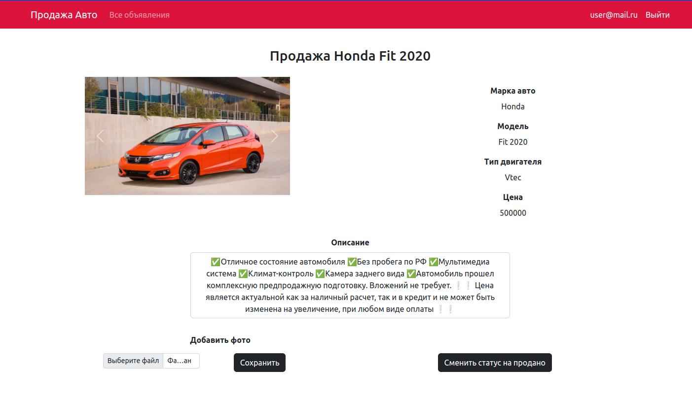
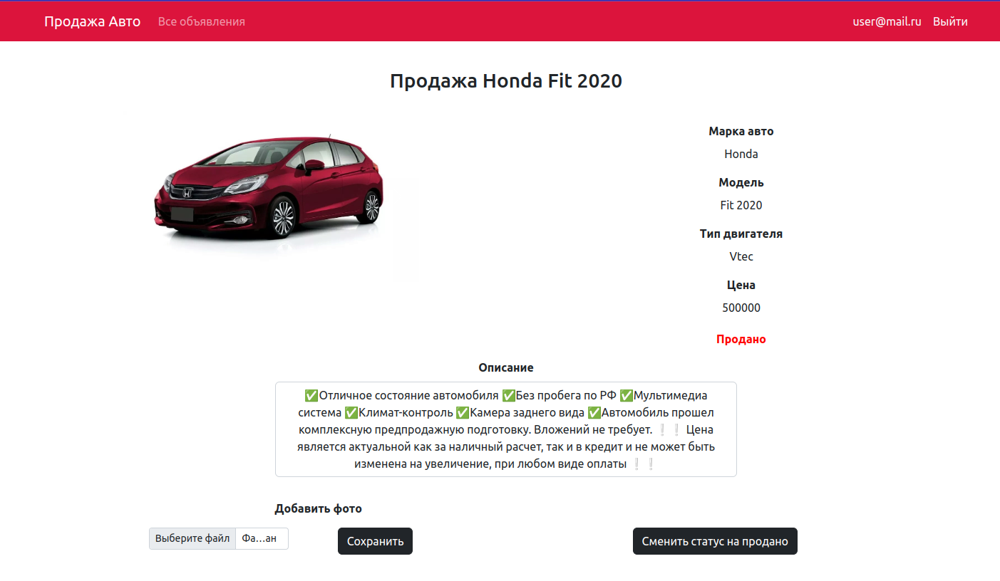